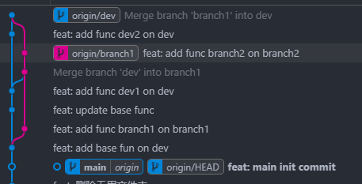
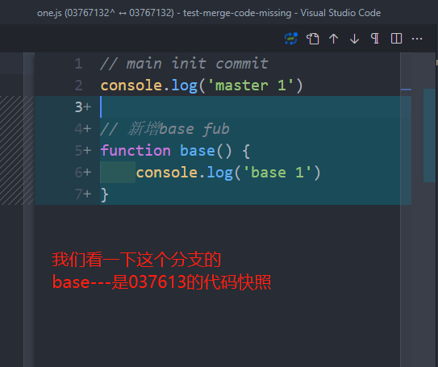
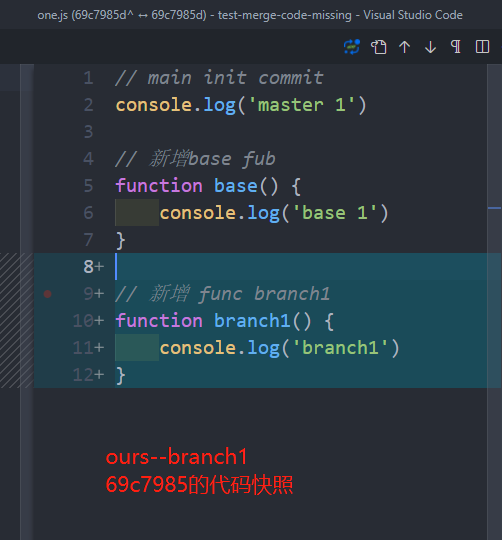
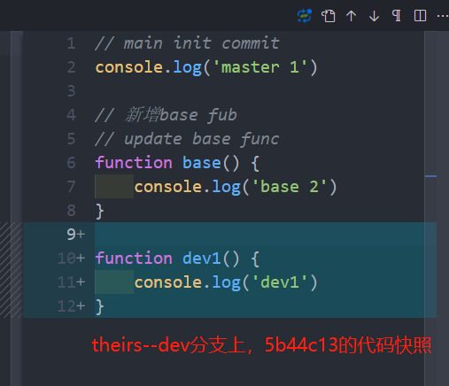
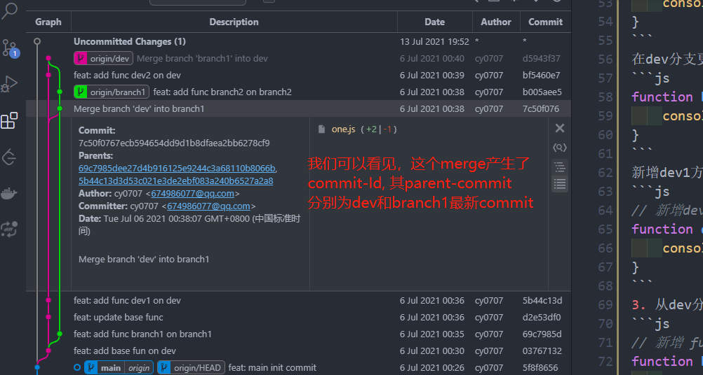
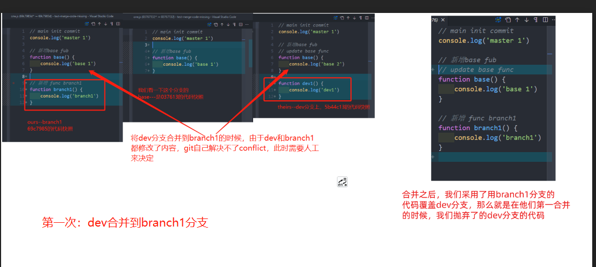
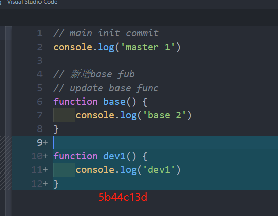
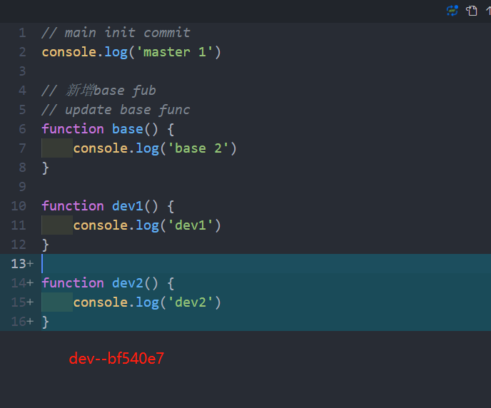
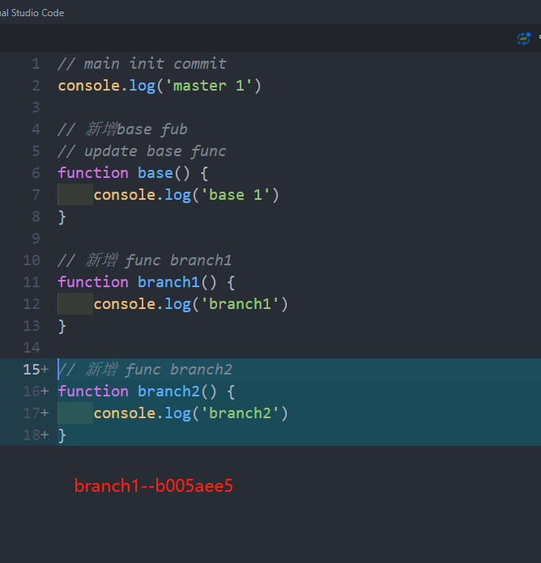
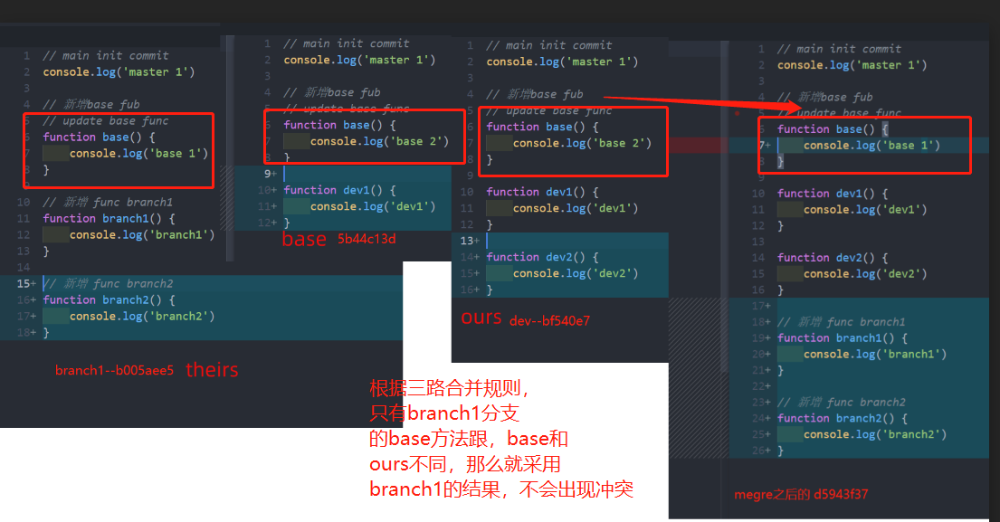

# 合并代码，代码丢失覆盖问题

## 背景

### 开发方式

我们开发方式采用的是主干（dev）开发为主，feature分支为辅。
  1. master保持线上一致，不会在该分支进行开发, 只会进行merge操作
  2. dev分支进行日常开发，一般在该迭代周期开发的功能，都会在dev上开发，迭代周期功能开发完成上线后，会把master merge dev上。
  3. 某些feature跨度周期比较长，不会在该迭代周期上线的功能，会从dev拉取feature分支，测试通过会merge到dev上，进行功能的发布，发布之后，merge到master上

### 问题产生的经过

  1. 由于业务需求，需要开发feature-天，feature-地，feature-玄，时间跨度一个多月，涉及迭代周期四个。
  2. 从dev分支拉取了一个feature-天分支，同时dev, feature-天分支同时提交几个commit, dev正常迭代（dev迭代1），feature-天正常功能开发
  3. 在dev开发提交几个commit之后，即完成当前迭代之后，把master merge dev, 同时从dev拉取分支feature-地
  4. 又在dev提交了几个commit，feature-天,feature-地同时也有相应的提交
  5. 由于发现feature-天，feature-地需要同时上线，且修改的代码，有部分是统一的地方，所以，被feature-地分支merge到feature-天（此时feature-地分支不再用了）
  6. 此时dev上又完成了一个迭代周期（dev迭代2），把dev分支合并到maser。
  7. 此时dev上进行（dev迭代3开发），feature-天持续开发，在dev迭代3开发完成后，突然发现feature-黄，需要开始，
  并在feature-天地玄，上线后过5天上线，又从dev上拉取了feature-黄分支，此时分支在feature-天，feature-黄，dev各自开发。
  8. 此时在dev又进行几个commit提交之后，又从该分支拉取feature-玄分支，最后确认
  feature都需要同时上线，此时把feature-黄合并到feature-天上。
  9. 此时dev分支又进行几个commit提交，feature-天，黄都分别进行commit提交，把feature-黄合并到feature-天上，在feature-天分支又进行提交commit。
  10. 至此feature分支开发完成后，准备feature merge dev, 发现dev分支的某些code被feature分支覆盖了

### 如何解决呢

发现这个问题后，人蒙蔽了，这个问题可大可小，在我个人看了，问题非常大，如果不是
测试发现，上线之后，问题可想而知。此时我们采用了人工对比方式，看来还是人脑智能
因为master分支是线上版本，我们把dev和master进行了全部对比，找到丢失的代码。


## 弄清楚问题产生的原因，尝试了以下方式

### git merge和rebase原理

  1. merge的合并策略(fast-forword, three-ways)
  2. merge的合并算法
  3. rebase是如何patch

### 搜索到类似问题

网上搜索到类似的文章，按照文章进行复现博主问题，由于博主提供的仓库不在了，
只能跟着截图和文字描述进行复现，虽然没有复现出跟博主同样的情况，但是却
复现了另一种代码覆盖的情况（three-way merge）

1. 在master分支，进行了提交one.js(5f8f865)
2. 从master拉取新分支dev, 在one.js新增如下代码(0376713)
```js
// 新增base fub
function base() {
    console.log('base 1')
}
```
更新base d2e53df
```js
function base() {
    console.log('base 2')
}
```
新增dev1方法 5b44c13
```js
// 新增dev1方法
function dev1() {
    console.log('dev1')
}
```
3. 从dev分支（0376713）拉取branch1分支，在one.js新增如下代(69c7985)
```js
// 新增 func branch1
function branch1() {
    console.log('branch1')
}
```
4. 在branch1分支合并dev分支，根据three-ways

**整个提交gitgraph**


**base--dev分支0376713**


**ours--branch1的69c7985**


**theirs--dev分支5b44c13**


根据three-ways合并原理，合并的时候，会出现冲突因为theirs和ours修改了同一个地方, 没法采用fast-forword方式，同时会产生一个merge-commit-id, 记录此时commit-id是由那两个commit合并

```js
Auto-merging one.js
CONFLICT (content): Merge conflict in one.js
Automatic merge failed; fix conflicts and then commit the result.
```



在解决冲突之后，我们代码长这样，摒弃了dev分支的code, 使用的branch1分支


在合并之后，我们在branch1分支，增加--b005aee
```js
// 新增 func branch2
function branch2() {
    console.log('branch2')
}
```

同时在dev分支，新增bf5460e
```js
function dev2() {
    console.log('dev2')
}
```

再把branch1分支合并到dev分支，产生了merge-commit-id(d5943f3)
此时我们发现我的dev分支，代码被覆盖了。为什么呢？
```js
// 本来dev的base方法是这样，合并branch1的代码之后，
function base() {
    console.log('base 2')
}
// 合并之后--直接采用了branch1的分支code
function base() {
    console.log('base 1')
}
```

**查找base的时候，如果分支比较复杂，可以使用**

```js
git merge-base bf5460e7 b005aee5
```

**base--dev分支5b44c13**


**ours--dev的bf5460e7**


**theirs--branch1分支b005aee5**



我们可以发现，根据three-ways,只有branch1的跟base 和ours的代码不同，合并的时候直接由branch1的分支直接覆盖。带着本来存在dev
分支的代码被覆盖

```js
//base和ours的
function base () {
  console.log(2)
}
// 而theirs
function base () {
  console.log(1)
}
```

merge之后
